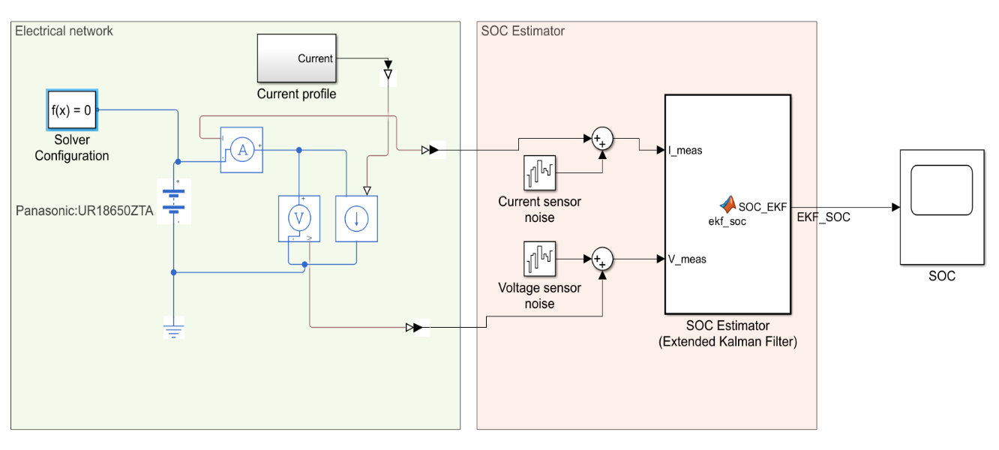
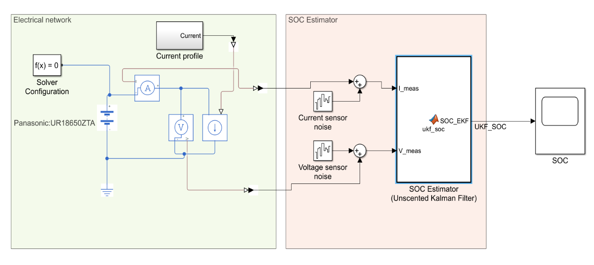
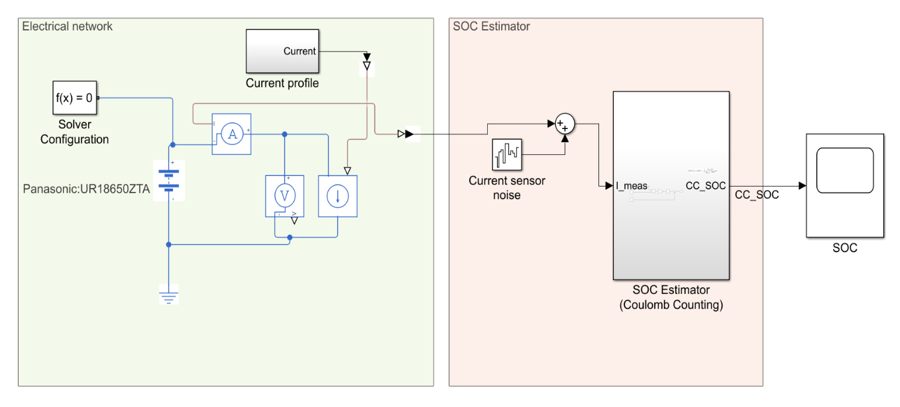
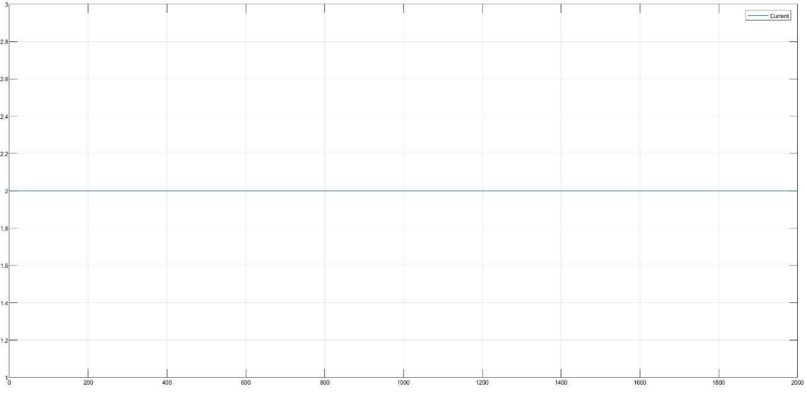
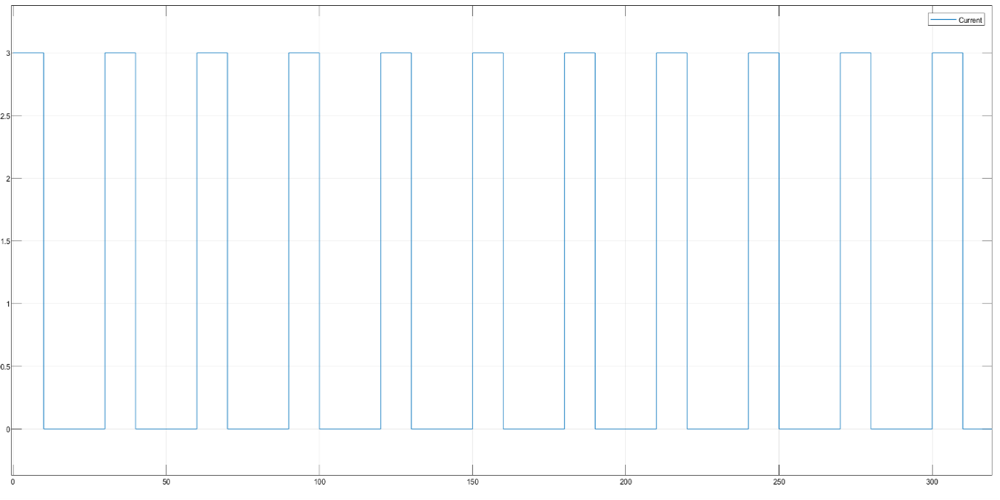

# Battery SOC Estimation using EKF and UKF

This repository contains a MATLAB/Simulink graduation project for lithium-ion battery State of Charge (SOC) estimation using three methods:

* Coulomb Counting (CC)
* Extended Kalman Filter (EKF)
* Unscented Kalman Filter (UKF)

The project compares the accuracy and robustness of the three estimators using a first-order Thevenin equivalent circuit battery model. The model is parameterized for a Panasonic UR18650ZTA lithium-ion cell and tested under different current profiles, initial SOC errors, voltage sensor noise, and current sensor bias.

---

## Project Overview

State of Charge (SOC) is one of the most important internal states in a Battery Management System (BMS). It cannot be measured directly, so it must be estimated from measurable signals such as battery current and terminal voltage.

This project implements a simulation-based SOC estimation framework in MATLAB/Simulink. A battery plant model is connected to three SOC estimators running in parallel:

1. **Coulomb Counting** as the baseline method.
2. **Extended Kalman Filter** as a model-based nonlinear estimator.
3. **Unscented Kalman Filter** as a sigma-point Kalman filter estimator.

The estimators are compared using:

* Root Mean Square Error (RMSE)
* Maximum absolute SOC error
* Convergence time from wrong initial SOC

---

## Objectives

The main objectives of this project are:

* Implement a first-order Thevenin Equivalent Circuit Model (1-RC ECM) for a lithium-ion battery in MATLAB/Simulink.
* Develop EKF and UKF algorithms for battery SOC estimation.
* Compare EKF and UKF performance against the traditional Coulomb Counting method.
* Evaluate estimator robustness under initial SOC error, voltage measurement noise, and current sensor bias.

---

## Battery Model

The battery plant is based on a first-order Thevenin equivalent circuit model. The model includes:

* Open-circuit voltage lookup table, `OCV(SOC)`
* Ohmic resistance, `R0`
* One RC polarization branch, `R1-C1`
* Terminal voltage measurement
* Current measurement
* True SOC output from the Simscape battery model

The battery is implemented using the **Battery (Table-Based)** block in Simscape Electrical.

Main battery parameters are stored in:

```text
scripts/BatterySOCEstimationData.m
```

The parameter file includes:

* SOC lookup breakpoints
* Temperature lookup points
* OCV table
* R0 table
* R1 table
* Time constant table
* Cell capacity
* Kalman filter tuning values

---

## Simulink Implementation

The project was implemented in MATLAB/Simulink using a physical battery plant and estimator blocks.

The EKF and UKF estimators are implemented using MATLAB Function blocks. Readable copies of the estimator code are provided in:

```text
src/estimators/
```

### EKF Simulink Model



### UKF Simulink Model



### Coulomb Counting Simulink Model



---

## Test Current Profiles

Two current profiles were used to test the estimators.

### Constant-Current Discharge

A constant discharge current of 2 A was used to test estimator behavior under a simple load condition.



### Pulse-Current Profile

A pulse current profile of 3 A for 10 seconds followed by 20 seconds rest was used to test estimator behavior under dynamic loading.



Pulse generator configuration:

```text
Amplitude: 3 A
Period: 30 s
Pulse width: 33% of period, approximately 10 s
Phase delay: 0 s
```

---

## Test Scenarios

The estimators were evaluated under six test scenarios.

| Test | Current Profile | Plant SOC₀ | EKF/UKF SOC₀ | CC SOC₀ | Disturbance                  |
| ---- | --------------- | ---------: | -----------: | ------: | ---------------------------- |
| T1   | Constant 2 A    |        0.5 |          0.5 |     0.5 | None                         |
| T2   | Constant 2 A    |        0.5 |          0.8 |     0.8 | Wrong initial SOC (+30%)     |
| T3   | Pulse 3 A / 0 A |        0.5 |          0.5 |     0.5 | None                         |
| T4   | Pulse 3 A / 0 A |        0.5 |          0.8 |     0.8 | Wrong initial SOC (+30%)     |
| T5   | Pulse 3 A / 0 A |        0.5 |          0.8 |     0.8 | Voltage sensor noise         |
| T6   | Pulse 3 A / 0 A |        0.5 |          0.8 |     0.8 | Current sensor bias (+0.1 A) |

The CSV version of this table is available at:

```text
results/tables/test_scenarios.csv
```

---

## Results

### T1: Constant Current with Matched Initial SOC

In this test, the plant and all estimators start from the same initial SOC of 0.5.


---

### T2: Constant Current with Wrong Initial SOC

In this test, the true battery SOC starts at 0.5, while EKF, UKF, and Coulomb Counting start at 0.8.

The Kalman filter estimators correct the initial SOC error using voltage feedback. Coulomb Counting remains offset because it has no correction mechanism.


---

### T3: Pulse Current with Matched Initial SOC

This test uses a pulse current profile with matched initial SOC.


---

### T4: Pulse Current with Wrong Initial SOC

This test uses a pulse current profile with 30% initial SOC error.


---

### T5: Pulse Current with Voltage Sensor Noise

This test evaluates estimator robustness when voltage measurement noise is added.


---

### T6: Pulse Current with Current Sensor Bias

This test evaluates estimator robustness when a +0.1 A current sensor bias is added.

Coulomb Counting accumulates current measurement error over time, while EKF and UKF maintain better performance because they use terminal voltage feedback.


---

## Performance Summary

| Test | Profile                     | EKF RMSE (%) | UKF RMSE (%) | CC RMSE (%) | EKF Max Error (%) | UKF Max Error (%) | CC Max Error (%) | EKF Conv. (s) | UKF Conv. (s) |
| ---- | --------------------------- | -----------: | -----------: | ----------: | ----------------: | ----------------: | ---------------: | ------------: | ------------: |
| T1   | Constant                    |         0.80 |         0.74 |        0.00 |              1.30 |              1.37 |             0.01 |             - |             - |
| T2   | Constant, wrong initial SOC |         0.83 |         0.78 |       30.00 |              5.70 |              5.67 |            30.00 |           4.0 |           4.0 |
| T3   | Pulse                       |         0.46 |         0.27 |        0.03 |              0.79 |              0.55 |             0.04 |             - |             - |
| T4   | Pulse, wrong initial SOC    |         0.52 |         0.37 |       29.98 |              5.70 |              5.65 |            30.00 |           4.0 |           4.0 |
| T5   | Pulse + voltage noise       |         1.50 |         1.51 |       29.98 |              4.78 |              5.01 |            30.00 |             - |             - |
| T6   | Pulse + current bias        |         0.62 |         0.45 |       31.03 |              5.62 |              5.57 |            32.08 |           3.0 |           3.0 |

The CSV version of this table is available at:

```text
results/tables/metrics_summary.csv
```

---

## Key Findings

The simulation results show that:

* Coulomb Counting performs well only when the initial SOC is correct and there is no current sensor bias.
* Coulomb Counting cannot correct wrong initial SOC because it is an open-loop method.
* EKF and UKF can correct wrong initial SOC using terminal voltage feedback.
* EKF and UKF strongly outperform Coulomb Counting under realistic disturbances.
* UKF generally gives lower RMSE than EKF in most scenarios.
* Current sensor bias has a major effect on Coulomb Counting because the error accumulates over time.

---

## Repository Structure

```text
battery-soc-estimation-ekf-ukf/
│
├── README.md
├── requirements.md
├── .gitignore
│
├── models/
│   └── battery_soc_estimation_ekf_ukf.slx
│
├── scripts/
│   ├── BatterySOCEstimationData.m
│   └── compute_metrics.m
│
├── src/
│   └── estimators/
│       ├── ekf_soc.m
│       └── ukf_soc.m
│
├── docs/
│   └── images/
│       ├── model_coulomb_counting.png
│       ├── model_ekf.png
│       ├── model_ukf.png
│       ├── current_constant_2A.png
│       ├── current_pulse_3A_10s_20s.png
│       └── pulse_generator_configuration.png
│
└── results/
    ├── figures/
    │   ├── T1_constant_matched_initial_soc.png
    │   ├── T2_constant_wrong_initial_soc.png
    │   ├── T3_pulse_matched_initial_soc.png
    │   ├── T4_pulse_wrong_initial_soc.png
    │   ├── T5_pulse_voltage_noise.png
    │   └── T6_pulse_current_bias.png
    │
    └── tables/
        ├── test_scenarios.csv
        └── metrics_summary.csv
```

---

## How to Run

1. Open MATLAB.

2. Clone or download this repository.

3. Add the repository folder to the MATLAB path.

4. Run the battery parameter setup script:

```matlab
run("scripts/BatterySOCEstimationData.m")
```

5. Open the Simulink model:

```matlab
open_system("models/battery_soc_estimation_ekf_ukf.slx")
```

6. Run the simulation from Simulink.

7. After the simulation finishes, run the metrics script:

```matlab
run("scripts/compute_metrics.m")
```

The script calculates:

* EKF RMSE
* UKF RMSE
* Coulomb Counting RMSE
* Maximum absolute error
* EKF convergence time
* UKF convergence time

---

## Requirements

This project was developed using MATLAB/Simulink.

Recommended software:

* MATLAB
* Simulink
* Simscape
* Simscape Electrical

The project was tested on a MATLAB/Simulink environment with a Simscape Electrical battery model.

---

## Notes

The battery parameter script is based on a MATLAB/Simscape battery SOC estimation example and keeps the original MathWorks copyright notice where applicable.

The EKF and UKF implementations were added as custom MATLAB Function blocks for the graduation project comparison.

---

## Limitations

* The work is simulation-based and was not validated using real experimental battery data.
* The battery plant uses a first-order Thevenin equivalent circuit model.
* Thermal effects are not deeply analyzed.
* Aging effects are only represented indirectly through disturbance and robustness testing.
* The estimator parameters are fixed and not adapted online.

---

## Future Work

Possible future improvements include:

* Validate the estimators using experimental battery data.
* Add temperature-dependent SOC estimation.
* Test adaptive EKF and adaptive UKF methods.
* Add online parameter estimation for R0, R1, and C1.
* Implement the estimator on a microcontroller.
* Extend the model from a single cell to a battery pack.

---

## Authors

Muhammed AbdulZahra Zaboun
Ali Majeed Kadhuim

Department of Electronics and Communications Engineering
College of Engineering
Gilgamesh University

Academic year: 2025–2026

---

## Keywords

Battery Management System, State of Charge, Lithium-ion Battery, Coulomb Counting, Extended Kalman Filter, Unscented Kalman Filter, MATLAB, Simulink, Simscape Electrical, Thevenin Model
